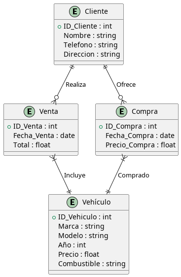

# FASTCAR, COMPRA-VENTA DE COCHES

Creamos el package.json

```bash
npm install --save express express-session mysql2 pug body-parser
```

¿Qué es cada cosa?

* **express**: servidor Web para node.js
* **express-session**: gestiona sesiones (HTTP) entre el servido Web/cliente Web
* **mysql2**: driver para conectar a mysql. 
* **pug**: motor HTML
* **body_parser**: para convertir los datos de un formulario (verbos GET y POST) en JSON.
* **dotenv**: para cargar archivos de configuración de entorno.

Inicializamos el repositorio(hemos creado el .gitignore antes):

```bash
git init
git add .
git commit -m "Inicio proyecto"
```

Creamos la base de datos compraventa a partir del diagrama:



* **Cliente**: Contiene la información básica de los clientes.
* **Vehiculo**: Almacena los datos de los vehículos.
* **Venta**: Registra las ventas realizadas por los clientes.
* **Compra**: Registra las compras realizadas por los clientes.
* **Venta_Vehiculo y Compra_Vehiculo**: Son tablas intermedias para establecer relaciones de "muchos a muchos" entre las tablas Venta y Vehiculo, y entre Compra y Vehiculo, respectivamente.
